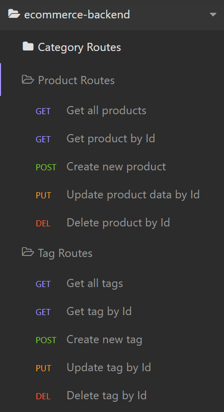
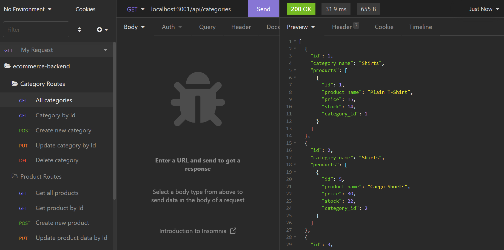

# E-Commerce Back End Using MySql
 

## Description

- A back end for an e-commerce website that uses a MySQL database.
- Built using the following technologies:
    - Node.js
    - Express.js
    - [MySQL2](https://www.npmjs.com/package/mysql)
    - [Sequelize](https://www.npmjs.com/package/sequelize)
    - [dotenv](https://www.npmjs.com/package/dotenv)

<br>

## Installation

* To use this application, you need to have Node.js and MySQL installed.

* To run the app:
    1. Clone this repository.
    2. Open up your terminal, navigate to the folder path, and enter the following command to install all dependencies:<br>
    ```npm i```
    3. Create an environment variable(.env) file and add your MySQL username and MySQL password. A sample .env file is provided.

<br>

## Usage

To start using the application:
1. Create the development database and seed it with test data:
    - Login to MySQL and run the schema.
    - In the terminal, enter ```npm run seed``` to seed the database with data.
2. Enter ```npm start``` to start running the application.

<br>
<p align="center">
    <i>Walkthrough - Starting the app</i>
</p>

https://user-images.githubusercontent.com/97539424/162342975-955a4756-818d-4517-8926-81333f08c707.mp4

<br>
<p align="center">
    <i>Walkthrough video - Testing routes in Insomnia</i>
</p>
<br>

https://user-images.githubusercontent.com/97539424/162343054-3c453625-eb5d-4029-9747-c2448b8c6ec6.mp4

<br>

<br>
<p align="center">
    
</p>
<br>

<br>
<p align="center">
    
</p>
<br>

## License
This code is licensed under [MIT License](https://mit-license.org/).

<br>

## Tests
This application has no tests as of the moment.
<br>

<hr>

## Questions
If you have any questions, please don't hesitate to contact:
 * Github - [github.com/nvsco-10](https://github.com/nvsco-10)
 * Email - neemavelasco@gmail.com

